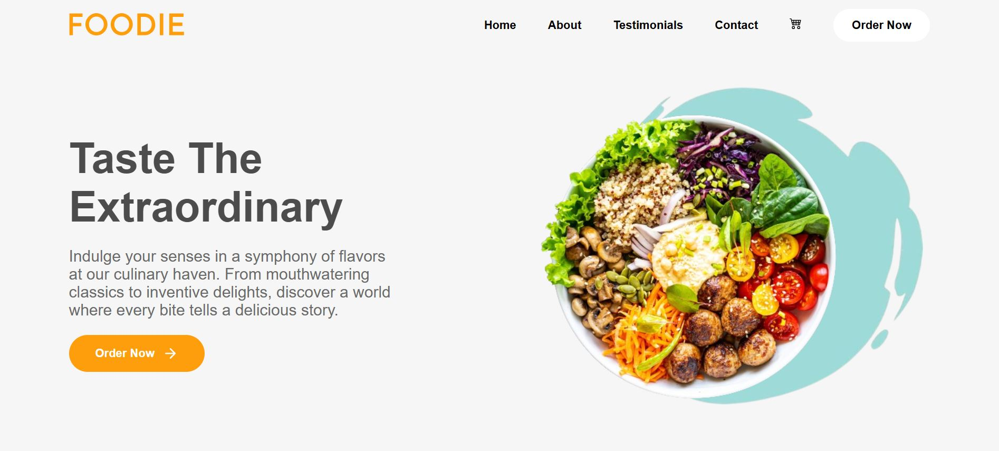

# Restaurant Landing Page

A simple, elegant landing page for a restaurant, built with **HTML**, **CSS**, and **JavaScript**.
## setup
```bash
git clone
```
### Available Scripts

In the project directory, you can run:

### `npm start`

Runs the app in the development mode.\
Open [http://localhost:3000](http://localhost:3000) to view it in your browser.

The page will reload when you make changes.\
You may also see any lint errors in the console.

## Screenshot


